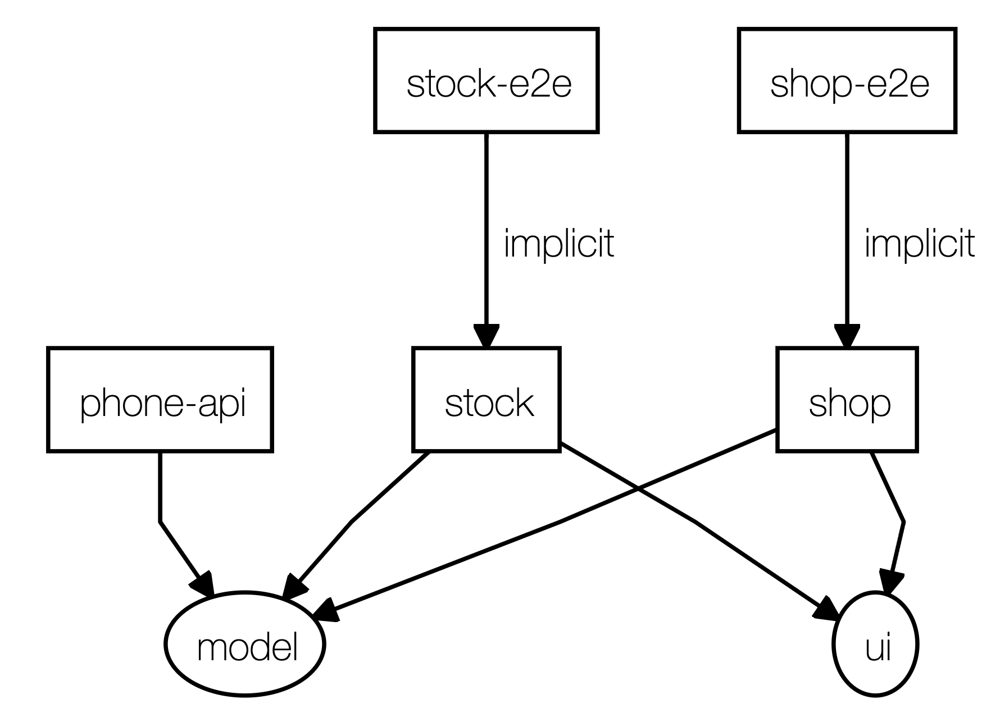
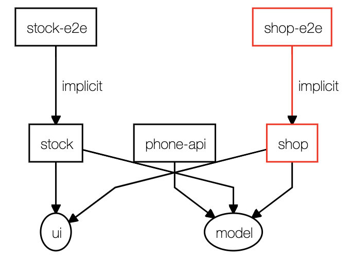

# NxPhone

This project was generated using [Nx](https://nx.dev).

<p align="center"></p>

🔎 **Nx is a set of Extensible Dev Tools for Monorepos.**

This is an example workspace showing the capabilities of Nx. The workspace contains three apps and two libs.
Inside the apps you can find two Angular apps, shop and stock, that are part of our imaginary phone company. The third one is a NestJS app that feeds both our Angular apps with data.

The libs contain a general model that's being used accross the different apps and a UI lib that contains reusable components for our Angular applications.

## Step by step guide
Here are the steps that I've took to create the workspace. We only focus on the CLI commands here. I've included links to specifics commits to give you an idea what the CLI is doing for us.

### Prerequisites
Having the Angular CLI installed will be convenient to run the commands later on. You can find it [here](https://cli.angular.io/);

### Creating the workspace
We'll start off by using Nx to scaffold our workspace. This can be done using the following command:
```
npx create-nx-workspace@latest nx-phone
```
I’ve chosen the empty workspace to show you all the steps, but you can opt for another one to save you a few commands later on. I'm using the Angular CLI because I’ve got that one installed already.

[Inital commit](https://github.com/DimiDeKerf/nx-phone/commit/23590bf48a38e63b32bbc7b22487b107d15f5702)

### Shop
Let’s start with adding a Angular app for our shop. First we’ll need to add the Angular capability to our workspace provided by nrwl:
```
npm install --save-dev @nrwl/angular
```
Next up we're going to add the Angular shop app:

```
ng g @nrwl/angular:application shop
```
[Related commits](https://github.com/DimiDeKerf/nx-phone/compare/23590bf...330bb3b)

### API
The backend will be a NestJS app. It will be a simple app that returns a static list of phones and exposes them over `/api/phones` endpoint.
Just like with Angular, we first have to include the Nest capability to our workspace:
```
npm install --save-dev @nrwl/nest
```

Great! Now we need to add the NestJS app itself to the workspace.

```
ng g @nrwl/nest:application phone-api --frontend-project shop
```
The `--frontend-project` flag will configure a proxy for our frontend, so we don't have to deal with CORS later on.

[Related commits](https://github.com/DimiDeKerf/nx-phone/compare/330bb3b...a8a830a)

### Shared model
We can share our Phone model between our shop and stock app. This will keep the model in sync between the applications. In order to accomplish this, we're going to introduce the model lib.
```
ng g @nrwl/workspace:lib model
```

[Related commits](https://github.com/DimiDeKerf/nx-phone/compare/2999b11...64ce9de)

### Stock
Time to add another app: to manage our stock, we'll be using the stock app. This is similar as adding the shop app:
```
ng g @nrwl/angular:application stock
```
What is a stock app without knowing the stock of our phones? That's why we add the stock attribute to the phone model and update our data within the API. The stock attribute now becomes available. Be sure to configure the proxy to the backend before calling it.

[Related commits](https://github.com/DimiDeKerf/nx-phone/compare/107c5cd...0371eed)

## Dependencies
As you continue to work on the monorepo, more apps and libs will be added and more dependencies gets introduced. Nx is able to figure out those dependencies then visualises them in a dependency graph. To get an overview of the current dependencies, you can run the following command:
```
npm run dep-graph
```

This will trigger the `nx dep-graph` command, which opens the browser with the resulting graph.



Nx can also track which dependencies are affected by your latest changes and only run the tests for those dependencies, resulting in lower build times. You can do this by running:
```
npm run dep-graph
```

In this example, we've made a change to the shop app. As you can see, only the shop-e2e app is affected by this change.


